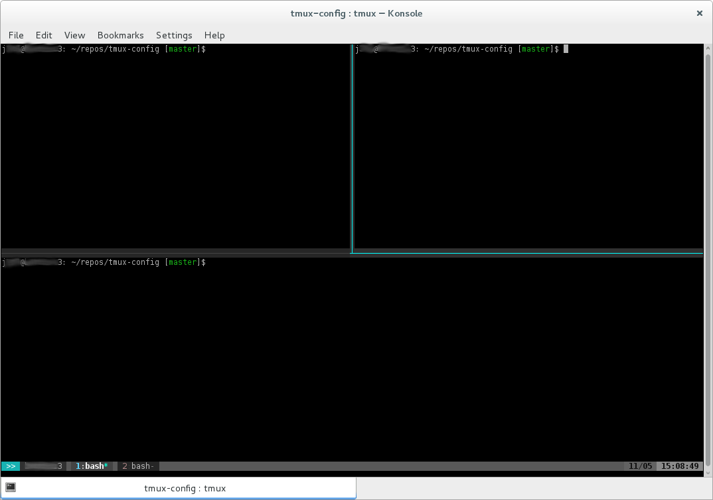

# tmux-config
This config addresses
- design
- host specific color identification (based on hostname)

The design is based on work of: [http://www.hamvocke.com/blog/a-guide-to-customizing-your-tmux-conf/]([http://www.hamvocke.com/blog/a-guide-to-customizing-your-tmux-conf/])




## Special Shortcuts

| shortcut | meaning |
| :------: | :-----: |
| ctrl + b |                      prefix |
| alt + ctrl + left  |    previous window |
| alt + ctrl + right |        next window |
| ctrl + arrow | switch pane in direction of arrow|

Mouse mode is enabled which means you can click panes or window tabs to focus them.

## Identify Current Host
I'm working on lot's of different machines. As I use this tmux config on all of it, I get confiused sometimes.
The config therefore includes the host name within the status bar and a colored block with the color comming from a simple hash over the hostname.
This let you recognize immediatly on which machine you work right now.

## Install (all in one. Handle with care! / using bash is expected)
```
cd $HOME && git clone https://github.com/jhertfe/tmux-config.git && cd tmux-config && ./setup && cd .. && rm -rf tmux-config && touch $HOME/.bash_aliases && grep -qxF 'alias tmux="tmux -2"' $HOME/.bash_aliases || echo 'alias tmux="tmux -2"' >> $HOME/.bash_aliases
```

## Install (step-by-step)
The repo contains two files. One is hidden for unix systems as it starts with a dot!
1. Clone the repo
```bash
git clone https://github.com/jhertfe/tmux-config.git
```
2. cd into it
```bash
cd tmux-config
```
2. execute setup
```bash
chmod 750 setup
./setup
```
3. use tmux with -2 flag! This enables 256 color support. I set an alias on my machines that maps. Open your ~/.bashrc therefore and add
```bash
alias tmux='tmux -2'
```
4. enjoy =)

## Hint
If you want to use this on different machines do NOT copy the .tmux.conf from your home directory unless you want the same color on the other machine. If you want to use it with its own color code copy the repo instead and execute setup again, since this is where the hash gets converted to the color.
